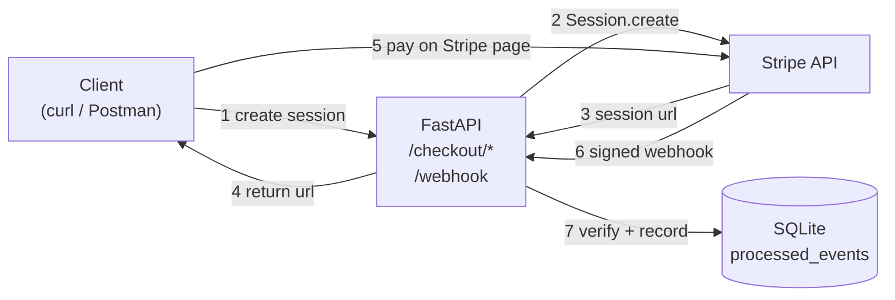
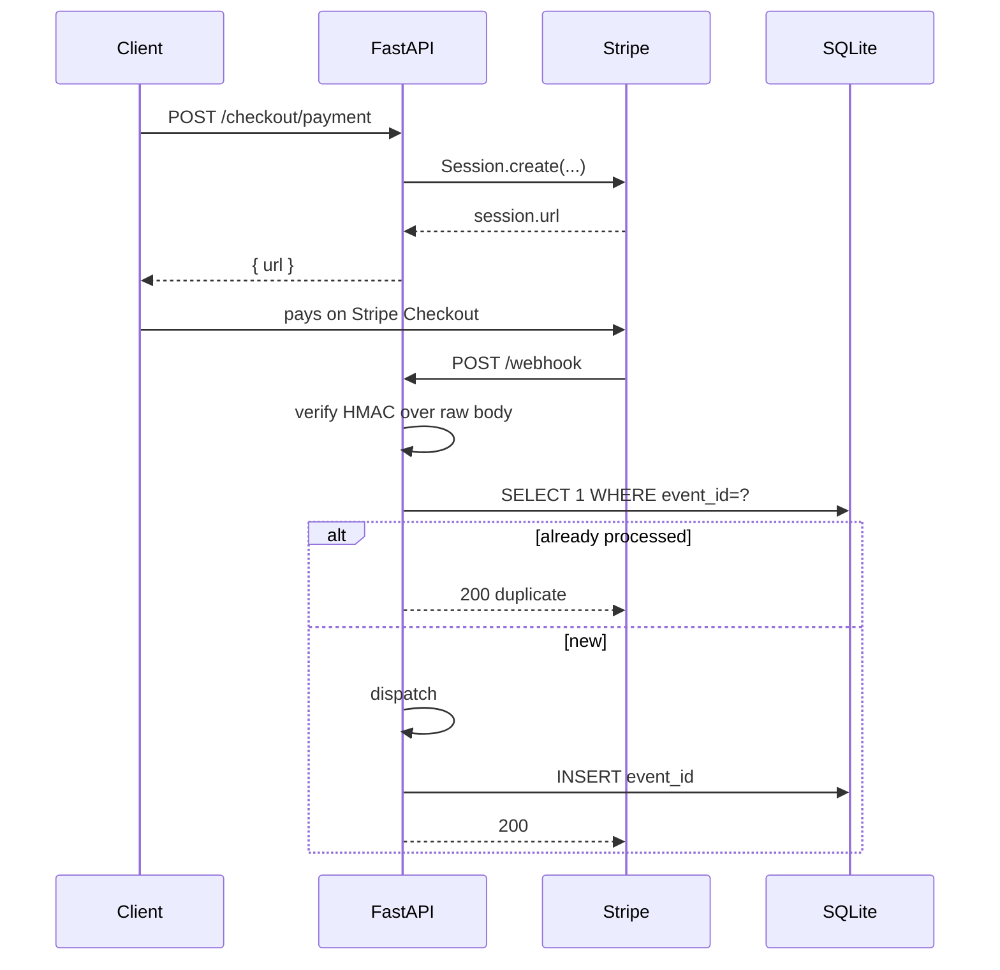

# stripe-integration-reference

Stripe Checkout and webhooks with signature verification and idempotency. Python/FastAPI, SQLite.

Built while going through the Stripe docs end to end.

## What it does

- `POST /checkout/payment` and `/checkout/subscription` create Checkout Sessions.
- `POST /webhook` verifies the Stripe signature against the raw body, dedupes on `event.id`, and dispatches four events: `checkout.session.completed`, `invoice.paid`, `invoice.payment_failed`, `customer.subscription.deleted`.
- Every event logs a single JSON line with `event_id`, `event_type`, `status`.


## Architecture





## Run it

```bash
git clone https://github.com/franaguiargit/stripe-integration-reference.git
cd stripe-integration-reference
python -m venv .venv && source .venv/bin/activate
pip install -r requirements.txt
cp .env.example .env     # add your Stripe test keys
uvicorn src.main:app --reload --port 8000
```

In another terminal:

```bash
stripe listen --forward-to localhost:8000/webhook
```

Paste the `whsec_...` into `.env`, restart the server, then:

```bash
curl -X POST http://localhost:8000/checkout/payment \
  -H "Content-Type: application/json" \
  -d '{"amount": 2000, "currency": "usd", "product_name": "Test"}'
```

Open the returned `url` and pay with `4242 4242 4242 4242`.

## Tests

```bash
pytest
```

Three cases: valid signed event is recorded, duplicate is skipped, invalid signature returns 400. Signatures are real HMACs, not mocked.

## Signature verification

Stripe signs each webhook with HMAC-SHA256 over the raw bytes of the request body plus a timestamp. If you parse the JSON first and re-serialize it, key order changes and the HMAC fails, even with the correct secret.

```python
payload = await request.body()          # raw bytes
event = stripe.Webhook.construct_event(
    payload=payload,
    sig_header=request.headers["stripe-signature"],
    secret=STRIPE_WEBHOOK_SECRET,
)
```

Reject with 400 on failure. Don't echo the reason back.

## Idempotency

Stripe retries for up to 3 days on any non-2xx and sometimes delivers duplicates on 2xx too. The handler has to be safe to run N times.

```sql
CREATE TABLE processed_events (
    event_id     TEXT PRIMARY KEY,
    event_type   TEXT NOT NULL,
    processed_at TEXT NOT NULL
);
```

On each event: verify, check the table, dispatch if new, insert, return 200. In production this would be Postgres with a unique index; same pattern.

## Stripe CLI

```bash
stripe listen --forward-to localhost:8000/webhook
stripe trigger checkout.session.completed
stripe trigger invoice.paid
stripe trigger invoice.payment_failed
```

Triggered events go through real signature verification and idempotency.

## Stack

Python 3.11+, FastAPI, `stripe` SDK, SQLite, Uvicorn, Pytest.
